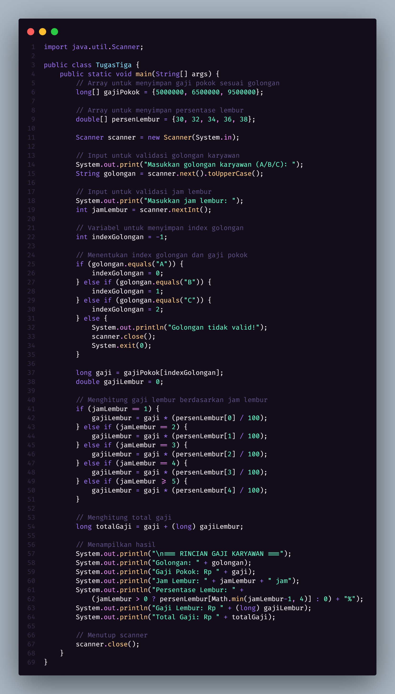

## Program Perhitungan Gaji Karyawan dengan Lembur

### Deskripsi Program

Program ini adalah sistem perhitungan gaji karyawan sederhana yang dibuat menggunakan bahasa pemrograman Java. Program ini menghitung total gaji karyawan berdasarkan golongan dan jam lembur yang diinputkan oleh user.

### Dibuat Oleh: Muhamad Alwan Sholeh
### Mata Kuliah: aLGORITMA DAN PEMOGRAMAN

